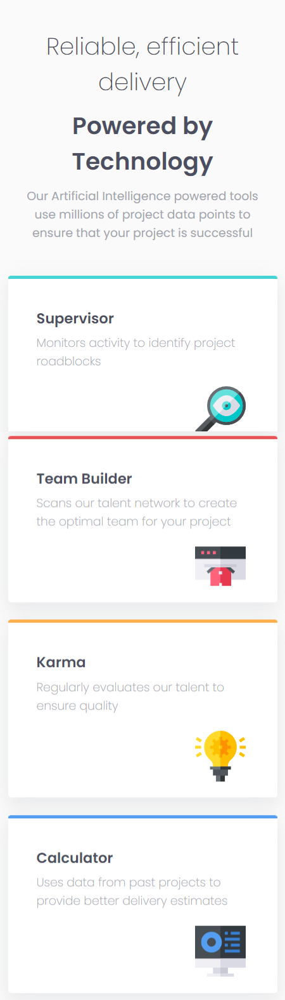
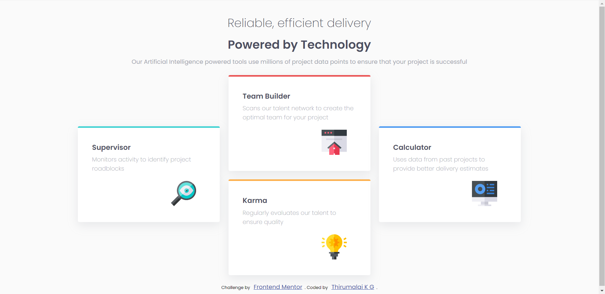

# Frontend Mentor - Four Card Feature Section Solution

This is a solution to the [Four card feature section challenge on Frontend Mentor](https://www.frontendmentor.io/challenges/four-card-feature-section-weK1eFYK). Frontend Mentor challenges help you improve your coding skills by building realistic projects. 

## Table of contents

- [Overview](#overview)
  - [The challenge](#the-challenge)
  - [Screenshot](#screenshot)
  - [Links](#links)
- [My process](#my-process)
  - [Built with](#built-with)
  - [What I learned](#what-i-learned)
  - [Useful resources](#useful-resources)
- [Author](#author)

## Overview

### The challenge

Users should be able to:

- View the optimal layout for the component depending on their device's screen size

### Screenshot

Mobile Version:

Desktop Version:

### Links

- Solution URL: [Solution](https://github.com/Thiru-Malai/Front-End-Challenges-dev.to/tree/main/four-card-feature-section-master)
- Live Site URL: [Live Site](https://four-card-feature-section-zeta-red.vercel.app/)

### My Process

### Built with

- Semantic HTML5 markup
- CSS custom properties
- CSS Grid
- Flex Box
- Mobile-first workflow

### What I learned

I have learnt about:
1. CSS - Grids
2. Positioning
3. Media Queries - Responsive Design
4. Flexbox

### Useful resources

- [Grids](https://www.youtube.com/watch?v=EiNiSFIPIQE&t=463s&pp=ygUJY3NzIGdyaWRz) - This video helped me to learn about CSS Grids and it's properties.
- [Box Shadows](https://www.corelangs.com/css/box/shadow.html) - This is an amazing website which helped me to study about box shadows.

## Author

- Website - [Thirumalai](https://github.com/Thiru-Malai)
- Frontend Mentor - [@Thiru-Malai](https://www.frontendmentor.io/profile/Thiru-Malai)
